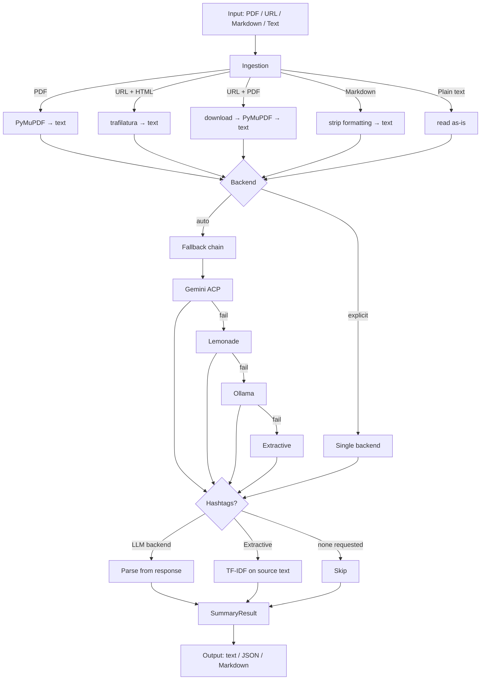

# tldr-scholar

Summarize academic papers, articles, and documents from the command line
or from Python. Reads PDFs, URLs, Markdown, and plain text. Produces
structured, jargon-free summaries with optional hashtags for social media.

## Features

- **Four input formats**: PDF, URL (HTML or PDF), Markdown, plain text
- **Four summarization backends**: Gemini (cloud, via ACP), Lemonade (local),
  Ollama (local), extractive (sumy — no LLM needed)
- **Three audience personas**: expert (default), layman, student (tailors complexity and structure)
- **Two prompt modes**: scientific (IMRAD-aware, structured sentences) and
  general (simpler, for non-academic text)
- **Hashtag generation**: LLM-derived or TF-IDF fallback with **bigram support** (e.g., #machine_learning)
- **Three output formats**: plain text, JSON, Markdown
- **Zero-config startup**: works immediately with the extractive backend
- **Library API**: `from tldr_scholar import summarize`

## How it works



## Installation

```bash
pip install -e path/to/tldr-scholar          # core (extractive backend always available)
pip install -e "path/to/tldr-scholar[dev]"   # with test dependencies
```

### Prerequisites

- Python 3.11+
- For Gemini backend: `pip install -e path/to/gemini-acp[acp]` + `gemini auth login`
- For Lemonade backend: Lemonade Server running (`lemonade status`)
- For Ollama backend: Ollama running (`ollama serve`)
- For extractive backend: nothing — included in base install

## Quick start

```bash
# Summarize a PDF (uses extractive backend, no setup needed)
tldr-scholar paper.pdf

# Summarize for a layman audience with analogies
tldr-scholar paper.pdf --audience layman

# Summarize a URL with Lemonade, get 5 hashtags
tldr-scholar https://arxiv.org/abs/2401.12345 --backend lemonade --hashtags 5

# Short summary in JSON format
tldr-scholar paper.pdf --length short --format json

# General mode for a blog post with a casual tone
tldr-scholar https://example.com/blog-post --mode general --tone casual

# Enrich a URL with Gemini, long summary, focused on methodology
tldr-scholar https://doi.org/10.1234/foo --backend gemini --length long --focus "methodology"
```

## CLI reference

```
tldr-scholar [OPTIONS] SOURCE
```

| Option | Default | Description |
|--------|---------|-------------|
| `SOURCE` | required | File path or URL to summarize |
| `--length` | `medium` | `short` (3 sentences), `medium` (5), `long` (7) |
| `--max-chars` | — | Override length preset with exact character limit |
| `--focus` | `main findings...` | Thematic focus for the summary |
| `--hashtags` | `0` | Number of hashtags to generate (0 = disabled) |
| `--audience` | `expert` | `expert`, `layman`, `student` (affects complexity/analogies) |
| `--tone` | `professional` | `professional`, `casual`, `analytical` (for General mode) |
| `--format` | `text` | Output format: `text`, `json`, `markdown` |
| `--backend` | `auto` | `gemini`, `lemonade`, `ollama`, `extractive`, `auto` |
| `--mode` | `scientific` | Prompt mode: `scientific` (IMRAD-aware) or `general` |
| `--config` | — | Path to TOML config file |
| `--gemini-timeout` | `90` | Override Gemini request timeout in seconds |
| `--verbose` | off | DEBUG logging |
| `--quiet` | off | Suppress INFO, show WARNING only |

### Output formats

**Text** (default):
```
Summary text here.
#hashtag1 #hashtag2 #hashtag3
```

**JSON** (`--format json`):
```json
{
  "text": "Summary text here.",
  "hashtags": ["#machine_learning", "#ai"],
  "metadata": {
    "source": "paper.pdf",
    "input_type": "pdf",
    "backend_used": "lemonade",
    "max_chars": 500,
    "focus": "main findings and novel insights",
    "char_count": 487,
    "audience": "expert",
    "tone": "professional"
  }
}
```

**Markdown** (`--format markdown`):
```markdown
## Summary

Summary text here.

## Hashtags

#hashtag1 #hashtag2 #hashtag3
```

## Python library

```python
from tldr_scholar import summarize, summarize_file, summarize_url, AudienceEnum, ToneEnum

# Summarize text for a student audience
result = summarize(text="Long article text...", audience=AudienceEnum.STUDENT)
print(result.text)

# Summarize a file with a casual tone
result = summarize_file("paper.pdf", tone=ToneEnum.CASUAL, mode="general")
print(result.text)
```

### `SummaryResult` object

| Attribute | Type | Description |
|-----------|------|-------------|
| `.text` | `str` | The summary |
| `.hashtags` | `list[str]` | Generated hashtags (empty if not requested) |
| `.metadata` | `SummaryMetadata` | Source, backend, char count, audience, etc. |

## Summarization modes

### Scientific (default)

IMRAD-aware structured summarization for academic papers.

The prompt instructs the LLM to:
1. Prioritize Title, Abstract, Conclusion, Introduction, and Results
2. Skim Methods only for broad context
3. Produce exactly N structured sentences (3/5/7 depending on `--length`)
4. **Tailor complexity**: Experts get precise terminology; Laymen get analogies and big-picture focus.
5. Self-verify against the source for hallucinations and factual accuracy

### General

Simpler prompt for non-academic text — blog posts, news articles, documentation.
Same sentence count scaling, supports `--tone` (professional, casual, analytical).

## URL Fetching Strategy

When given a URL, `tldr-scholar` tries strategies in order until one succeeds:

1. **Chrome TLS fetch** — Uses `curl-cffi` to impersonate Chrome's TLS fingerprint.
2. **DOI extraction + Open Access lookup** — Fallback to Unpaywall, OpenAlex, or Semantic Scholar.
3. **OA PDF download** — Download and parse directly.

## Backends

### Fallback chain (`--backend auto`)

```
gemini → lemonade → ollama → extractive
```

### Extractive (no LLM needed)

Uses sumy's KL-divergence + LSA algorithm. Always available.
Hashtags are derived from TF-IDF term scoring with **bigram support**.

## Configuration

Optional TOML config file for persistent backend settings.

```bash
tldr-scholar paper.pdf --config tldr-scholar.toml
```

## Personal Style Synthesis

tldr-scholar can synthesize and replicate your individual writing style from past posts.

### 1. Synthesize your style

```bash
bin/synthesize-style path/to/your/posts.txt --name my-style
```

This generates a YAML profile in `~/.config/tldr-scholar/personas/my-style.yaml`.

### 2. Use your style

```bash
tldr-scholar paper.pdf --audience my-style
```

### Example config

```toml
[gemini]
model = "gemini-3-flash-preview"
timeout = 90

[lemonade]
model = ""                              # empty = auto-detect
host = "http://127.0.0.1:8000"
timeout = 60
ctx_size = 8192
load_timeout = 180
preferred_models = ["Phi-4-mini-instruct-GGUF", "Qwen3-8B-GGUF"]

[ollama]
model = "gemma3:9b"
host = "http://localhost:11434"
timeout = 90
```

## Exit codes

| Code | Meaning |
|------|---------|
| 0 | Success |
| 1 | Runtime error (file not found, backend failure, empty response) |
| 2 | Invalid arguments (bad backend, unsupported file type, bad format) |

## Development

```bash
cd tldr-scholar
pip install -e ".[dev]"
pytest
pytest --cov=tldr_scholar --cov-fail-under=100
```

## Architecture

```
tldr_scholar/
├── __init__.py          # Public API: summarize, summarize_file, summarize_url
├── cli.py               # Typer CLI with --audience, --tone, --mode flags
├── config.py            # Pydantic config models + TOML loading
├── models.py            # SummaryRequest, SummaryResult, SummaryMetadata
├── prompts.py           # PromptBuilder (scientific + general templates)
├── ingest.py            # PDF, HTML, Markdown, text ingestion
├── hashtags.py          # LLM parsing + TF-IDF with bigram support
└── backends/            # Backend implementations
```
