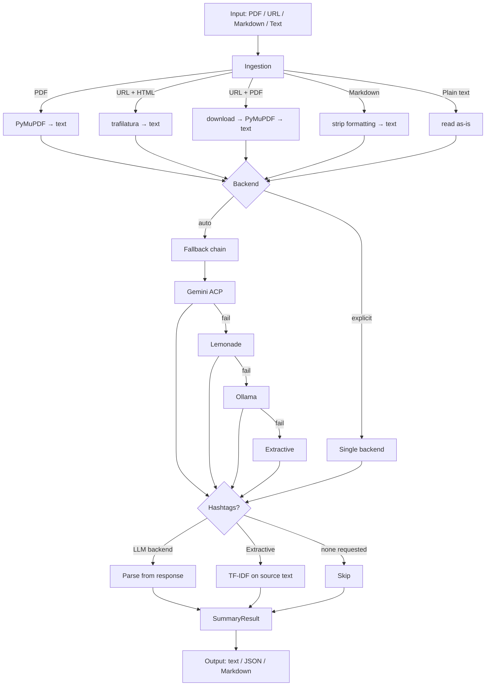

# tldr-scholar

Summarize academic papers, articles, and documents from the command line
or from Python. Reads PDFs, URLs, Markdown, and plain text. Produces
structured, jargon-free summaries with optional hashtags for social media.

## Features

- **Four input formats**: PDF, URL (HTML or PDF), Markdown, plain text
- **Four summarization backends**: Gemini (cloud, via ACP), Lemonade (local),
  Ollama (local), extractive (sumy — no LLM needed)
- **Two prompt modes**: scientific (IMRAD-aware, structured sentences) and
  general (simpler, for non-academic text)
- **Hashtag generation**: LLM-derived or TF-IDF fallback for the extractive backend
- **Three output formats**: plain text, JSON, Markdown
- **Zero-config startup**: works immediately with the extractive backend
- **Library API**: `from tldr_scholar import summarize`

## How it works



## Installation

```bash
pip install -e path/to/tldr-scholar          # core (extractive backend always available)
pip install -e "path/to/tldr-scholar[dev]"   # with test dependencies
```

### Prerequisites

- Python 3.11+
- For Gemini backend: `pip install -e path/to/gemini-acp[acp]` + `gemini auth login`
- For Lemonade backend: Lemonade Server running (`lemonade status`)
- For Ollama backend: Ollama running (`ollama serve`)
- For extractive backend: nothing — included in base install

## Quick start

```bash
# Summarize a PDF (uses extractive backend, no setup needed)
tldr-scholar paper.pdf

# Summarize a URL with Lemonade, get 5 hashtags
tldr-scholar https://arxiv.org/abs/2401.12345 --backend lemonade --hashtags 5

# Short summary in JSON format
tldr-scholar paper.pdf --length short --format json

# General mode for a blog post
tldr-scholar https://example.com/blog-post --mode general

# Enrich a URL with Gemini, long summary, focused on methodology
tldr-scholar https://doi.org/10.1234/foo --backend gemini --length long --focus "methodology"
```

## CLI reference

```
tldr-scholar [OPTIONS] SOURCE
```

| Option | Default | Description |
|--------|---------|-------------|
| `SOURCE` | required | File path or URL to summarize |
| `--length` | `medium` | `short` (3 sentences, ~200 chars), `medium` (5, ~500), `long` (7, ~1000) |
| `--max-chars` | — | Override length preset with exact character limit |
| `--focus` | `main findings and novel insights` | Thematic focus for the summary |
| `--hashtags` | `0` | Number of hashtags to generate (0 = disabled) |
| `--format` | `text` | Output format: `text`, `json`, `markdown` |
| `--backend` | `auto` | `gemini`, `lemonade`, `ollama`, `extractive`, `auto` |
| `--mode` | `scientific` | Prompt mode: `scientific` (IMRAD-aware) or `general` |
| `--config` | — | Path to TOML config file |
| `--gemini-timeout` | `90` | Override Gemini request timeout in seconds |
| `--verbose` | off | DEBUG logging |
| `--quiet` | off | Suppress INFO, show WARNING only |

### Output formats

**Text** (default):
```
Summary text here.
#hashtag1 #hashtag2 #hashtag3
```

**JSON** (`--format json`):
```json
{
  "text": "Summary text here.",
  "hashtags": ["#hashtag1", "#hashtag2"],
  "metadata": {
    "source": "paper.pdf",
    "input_type": "pdf",
    "backend_used": "lemonade",
    "max_chars": 500,
    "focus": "main findings and novel insights",
    "char_count": 487
  }
}
```

**Markdown** (`--format markdown`):
```markdown
## Summary

Summary text here.

## Hashtags

#hashtag1 #hashtag2 #hashtag3
```

## Python library

```python
from tldr_scholar import summarize, summarize_file, summarize_url

# Summarize text directly
result = summarize(text="Long article text...", max_chars=300)
print(result.text)

# Summarize a file
result = summarize_file("paper.pdf", hashtags=5, mode="scientific")
print(result.text)
print(result.hashtags)       # ["#machine", "#learning", ...]
print(result.metadata.source) # "paper.pdf"

# Summarize a URL
result = summarize_url("https://arxiv.org/abs/2401.12345",
                       backend="lemonade", focus="methodology")
```

### `SummaryResult` object

| Attribute | Type | Description |
|-----------|------|-------------|
| `.text` | `str` | The summary |
| `.hashtags` | `list[str]` | Generated hashtags (empty if not requested) |
| `.metadata` | `SummaryMetadata` | Source, backend, char count, etc. |

## Summarization modes

### Scientific (default)

IMRAD-aware structured summarization for academic papers.

The prompt instructs the LLM to:
1. Prioritize Title, Abstract, Conclusion, Introduction, and Results
2. Skim Methods only for broad context
3. Produce exactly N structured sentences (3/5/7 depending on `--length`)
4. Write in plain, jargon-free language for a non-specialist audience
5. Self-verify against the source for hallucinations and factual accuracy

Sentence structure (medium / 5 sentences):
1. General background of the topic
2. Specific problem or knowledge gap
3. Broad methodology
4. Primary result or data point
5. Broader implication, including limitations

### General

Simpler prompt for non-academic text — blog posts, news articles, documentation.
Same sentence count scaling, no IMRAD structure or verification guardrail.

## Backends

### Fallback chain (`--backend auto`)

```
gemini → lemonade → ollama → extractive
```

The first backend to produce a non-empty response wins. If an explicit backend
is selected (`--backend lemonade`), no fallback occurs — failure returns an error.

### Gemini (cloud)

Uses the [gemini-acp](https://github.com/davdittrich/gemini-acp) shared package
to communicate with Gemini CLI via the Agent Client Protocol.

```bash
pip install -e path/to/gemini-acp[acp]
gemini auth login
```

### Lemonade (local LLM — preferred)

OpenAI-compatible API via Lemonade Server. Auto-loads the best downloaded model
if none is running.

```bash
lemonade status        # verify server is running
lemonade pull Phi-4-mini-instruct-GGUF
```

Default preferred models (CPU-first ranking):

| Tier | Model | Params | RAM |
|------|-------|--------|-----|
| 1 (CPU) | Phi-4-mini-instruct-GGUF | 3.8B | ~2.5 GB |
| 1 (CPU) | Qwen3-4B-Instruct-2507-GGUF | 4B | ~2.8 GB |
| 2 (GPU) | Qwen3-8B-GGUF | 8B | ~5 GB |
| 2 (GPU) | DeepSeek-Qwen3-8B-GGUF | 8B | ~5 GB |

### Ollama (local LLM)

```bash
ollama serve
ollama pull gemma3:9b
```

### Extractive (no LLM needed)

Uses sumy's KL-divergence + LSA algorithm. Always available, no external
dependencies. Produces verbatim sentence extraction — accurate but mechanical.

When `--focus` is set, sentences containing focus keywords are ranked higher.

Hashtags are derived from TF-IDF term scoring (no NLTK dependency).

## Configuration

Optional TOML config file for persistent backend settings.

```bash
tldr-scholar paper.pdf --config tldr-scholar.toml
# or via environment variable:
export TLDR_SCHOLAR_CONFIG=path/to/tldr-scholar.toml
```

### Example config

```toml
[gemini]
model = "gemini-3-flash-preview"
timeout = 90

[lemonade]
model = ""                              # empty = auto-detect
host = "http://127.0.0.1:8000"
timeout = 60
ctx_size = 8192
load_timeout = 180
preferred_models = [
    "Phi-4-mini-instruct-GGUF",
    "Qwen3-4B-Instruct-2507-GGUF",
    "Qwen3-8B-GGUF",
]

[ollama]
model = "gemma3:9b"
host = "http://localhost:11434"
timeout = 30
```

## Exit codes

| Code | Meaning |
|------|---------|
| 0 | Success |
| 1 | Runtime error (file not found, backend failure, empty response) |
| 2 | Invalid arguments (bad backend, unsupported file type, bad format) |

## Security

- **Path traversal**: allowed — the tool runs as the user's own process
- **SSRF**: only `http`/`https` schemes permitted; no private-IP blocking
- **Prompt injection**: `<document>` delimiters in LLM prompts; impact limited
  to output manipulation
- **Credentials**: URL userinfo stripped from metadata; backend config never logged
- **Subprocess**: Lemonade model names validated against `^[A-Za-z0-9._-]{1,128}$`

## Development

```bash
cd tldr-scholar
pip install -e ".[dev]"
pytest
pytest --cov=tldr_scholar --cov-fail-under=100
```

## Architecture

```
tldr_scholar/
├── __init__.py          # Public API: summarize, summarize_file, summarize_url
├── cli.py               # Typer CLI with --mode, --length, --backend flags
├── config.py            # Pydantic config models + TOML loading
├── models.py            # SummaryRequest, SummaryResult, SummaryMetadata
├── prompts.py           # Scientific + general prompt templates
├── ingest.py            # PDF, HTML, Markdown, text ingestion
├── hashtags.py          # LLM response parsing + TF-IDF fallback
└── backends/
    ├── base.py          # BackendBase ABC
    ├── gemini.py        # Gemini ACP (cloud)
    ├── lemonade.py      # Lemonade (local, OpenAI-compatible)
    ├── ollama.py        # Ollama (local)
    └── extractive.py    # sumy KL+LSA (no LLM)
```

## Consumers

- **scholarposter** — cross-posts Mastodon toots with automated summarization
